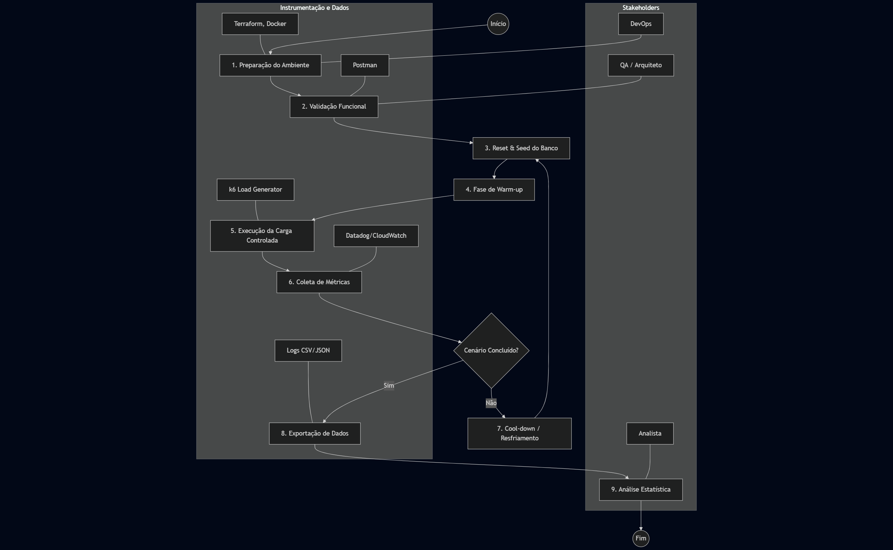

# proprosta_experimento_tcc

# Plano de Experimento – Scoping e Planejamento

## 1. Identificação básica
* **1.1 Título do experimento:** Avaliação de Desempenho e Escalabilidade: Backend Low-Code vs. High-Code (Node.js) sob Alta Demanda.
* **1.2 ID / código:** EXP001-FHC-LOP.
* **1.3 Versão do documento e histórico de revisão:**
*  - v1.0 (Criação inicial do rascunho).
   - v1.0.1 (Especificações técnicas do projeto)
   - v1.0.2 (Modelo conceitual e hipóteses; Variáveis, fatores, tratamentos e objetos de estudo; Desenho experimental)
   - v1.0.3 (População, sujeitos e amostragem; Instrumentação e protocolo operacional; Plano de análise de dados (pré-execução)) - Atual
* **1.4 Datas:** 21/11/2025
* **1.5 Autores:** Alfredo Luis Vieira - Graduando em Engenharia de Software
* **1.6 Responsável principal:** Alfredo Luis Vieira.
* **1.7 Projeto / produto / iniciativa relacionada:** Iniciativa de Arquitetura de Referência; Estudo de Viabilidade para Utilização de softwares de prateleira.

## 2. Contexto e problema
* **2.1 Descrição do problema / oportunidade:** Há uma incerteza técnica sobre se a plataforma Low-Code adotada (ou candidata) consegue suportar picos de acesso sem degradação severa de latência, o que impede sua adoção em sistemas cuja a demanda de acessos é alta, ofertando facilidade de implementação, plataformas low code podem custar caro em questões de desempenho, o que pode acabar causando danos para sistemas onde o acessso em massa é pesado.
* **2.2 Contexto organizacional e técnico:** A organização busca acelerar o desempenho usando Low-Code, mas precisa garantir que requisitos não funcionais (performance) sejam atendidos. 
* **2.3 Trabalhos e evidências prévias:** Relatos anedóticos de lentidão em relatórios complexos na plataforma atual; benchmarks genéricos de fornecedores (geralmente enviesados).
* **2.4 Referencial teórico e empírico essencial:** Teoria de filas; Conceitos de *Throughput* (vazão) e Latência; Overhead de abstração em frameworks de software.

## 3. Objetivos e questões (Goal / Question / Metric)

### 3.1 Objetivo geral (Goal Template)
**Analisar** a implementação de uma API REST de consulta (Low-Code vs. High-Code), **com o propósito de** caracterizar a degradação de performance e eficiência de recursos sob estresse, **sob a perspectiva de** Engenheiros de Software **no contexto de** uma aplicação corporativa crítica com picos de acesso, utilizando banco de dados relacional.

### 3.2 Objetivos específicos
* **(O1) Analisar a Latência Percebida:** Determinar o tempo de resposta e a estabilidade da entrega de dados para o cliente final sob diferentes cargas.
* **(O2) Avaliar a Capacidade de Vazão (Throughput):** Identificar o volume máximo de transações que a solução suporta antes da saturação dos recursos.
* **(O3) Mensurar a Eficiência de Hardware:** Verificar o "custo computacional" (CPU/Memória) necessário para processar as requisições em cada plataforma.
* **(O4) Verificar a Confiabilidade sob Estresse:** Analisar a taxa de falhas e o comportamento de recuperação do sistema quando submetido a cargas extremas.

### 3.3 e 3.4 Matriz GQM (Goal / Question / Metric)

| Objetivo Específico | Questões de Pesquisa (Questions) | Métricas Associadas (Metrics) |
| :--- | :--- | :--- |
| **O1. Latência** | **Q1.1** Qual é a latência basal do sistema em condições normais (sem concorrência)? | **[M01]** Tempo Médio de Resposta (ART) **[M02]** Desvio Padrão da Latência |
| | **Q1.2** Como a latência se comporta para os 5% dos usuários mais lentos (piores casos) sob carga? | **[M03]** Latência no Percentil 95 (p95) **[M04]** Latência no Percentil 99 (p99) |
| | **Q1.3** Qual é o fator de degradação da resposta quando a carga dobra de 100 para 200 usuários? | **[M05]** Fator de Degradação de Latência **[M01]** Tempo Médio de Resposta (ART) |
| **O2. Vazão** | **Q2.1** Qual é o número máximo de requisições por segundo (RPS) sustentável? | **[M06]** Max Throughput (RPS) **[M07]** Taxa de Sucesso de Requisições |
| | **Q2.2** Em que ponto de concorrência o sistema atinge a saturação (latência > 2s ou erros)? | **[M08]** Ponto de Saturação (Concurrent Users) **[M06]** Max Throughput (RPS) |
| | **Q2.3** O throughput se mantém estável ou oscila drasticamente durante o teste de *soak* (duração longa)? | **[M02]** Desvio Padrão da Latência **[M09]** Variação de Throughput (RPS Jitter) |
| **O3. Eficiência** | **Q3.1** Qual é o consumo médio de CPU para sustentar 500 usuários simultâneos? | **[M10]** Utilização Média de vCPU (%) **[M06]** Max Throughput (RPS) |
| | **Q3.2** Qual é a pegada de memória (footprint) da aplicação em repouso vs. carga máxima? | **[M11]** Consumo de Memória RAM (MB) **[M12]** Pico de Memória (Peak RSS) |
| | **Q3.3** Existe vazamento de recursos (*memory leak*) perceptível após 30 minutos de teste? | **[M11]** Consumo de Memória RAM (MB) **[M13]** Taxa de Crescimento de Memória/Hora |
| **O4. Confiabilidade** | **Q4.1** Qual é a porcentagem de requisições falhas (HTTP 5xx) sob estresse máximo? | **[M14]** Taxa de Erro (% Error Rate) **[M15]** Contagem Total de Exceções |
| | **Q4.2** O sistema apresenta *timeouts* de conexão antes de processar a requisição? | **[M16]** Contagem de Timeouts **[M03]** Latência no Percentil 95 (p95) |
| | **Q4.3** Após o término do pico de carga, quanto tempo o sistema leva para recuperar a latência normal? | **[M17]** Tempo de Recuperação (Recovery Time) **[M01]** Tempo Médio de Resposta (ART) |

### Tabela de Definição das Métricas

| ID | Nome da Métrica | Descrição | Unidade |
| :--- | :--- | :--- | :--- |
| **M01** | Tempo Médio de Resposta (ART) | Média aritmética do tempo total (round-trip) da requisição. | Milissegundos (ms) |
| **M02** | Desvio Padrão da Latência | Medida de dispersão que indica a estabilidade/variabilidade das respostas. | Milissegundos (ms) |
| **M03** | Latência Percentil 95 (p95) | Valor de tempo abaixo do qual estão 95% das requisições (ignora outliers). | Milissegundos (ms) |
| **M04** | Latência Percentil 99 (p99) | Valor de tempo abaixo do qual estão 99% das requisições (piores casos). | Milissegundos (ms) |
| **M05** | Fator de Degradação | Razão entre a latência sob carga máxima e a latência basal. | Razão (x vezes) |
| **M06** | Max Throughput | Maior taxa de requisições processadas com sucesso por segundo. | Req/seg (RPS) |
| **M07** | Taxa de Sucesso | Percentual de requisições que retornaram HTTP 200 OK. | Porcentagem (%) |
| **M08** | Ponto de Saturação | Número de usuários virtuais no momento da quebra de SLA (erro ou lentidão). | Usuários Virtuais (VUs) |
| **M09** | Variação de Throughput | Diferença entre o pico e o vale de RPS durante uma carga constante. | Req/seg (RPS) |
| **M10** | Utilização Média de vCPU | Porcentagem de uso dos núcleos de processamento do servidor. | Porcentagem (%) |
| **M11** | Consumo de Memória RAM | Memória residente (RSS) utilizada pelo processo da aplicação. | Megabytes (MB) |
| **M12** | Pico de Memória | O maior valor de memória registrado durante a execução. | Megabytes (MB) |
| **M13** | Taxa Crescimento Memória | Velocidade de aumento do uso de RAM ao longo do tempo (indica leak). | MB/hora |
| **M14** | Taxa de Erro | Proporção de requisições com status HTTP 500, 502, 503 ou 504. | Porcentagem (%) |
| **M15** | Contagem de Exceções | Número absoluto de erros não tratados logados no servidor. | Inteiro (Contagem) |
| **M16** | Contagem de Timeouts | Número de requisições abortadas por exceder o tempo limite do cliente. | Inteiro (Contagem) |
| **M17** | Tempo de Recuperação | Tempo necessário para a latência voltar à baseline após o fim da carga. | Segundos (s) |

---

## 4. Escopo e contexto do experimento

### 4.1 Escopo funcional / de processo
* **Incluído:** Desenvolvimento de 1 endpoint GET parametrizável. A lógica interna envolverá: recepção da requisição, validação básica de parâmetros, consulta SQL (SELECT com WHERE e LIMIT) em tabela populada com 50.000 registros e serialização do resultado para JSON.
* **Excluído:** Interface gráfica (frontend), autenticação complexa (OAuth/SSO), cache de aplicação (Redis/Memcached) — o objetivo é testar o processamento "bruto" da plataforma e não a eficiência de cache.

### 4.2 Contexto do estudo
* **Organização:** Equipe engenheiros de software em empresa de médio porte.
* **Ambiente Técnico:** Ambiente na AWS. Ambas as aplicações (Low-Code e Node.js) rodarão em contêineres com limites de recursos idênticos (ex: 1 vCPU, 2GB RAM) para isolar a variável "eficiência do software".
* **Dados:** Banco de dados PostgreSQL dedicado, pré-populado com dados sintéticos (fictícios) para garantir consistência entre testes.

### 4.3 Premissas
* O banco de dados não será o gargalo (será superdimensionado em relação à aplicação).
* A ferramenta de geração de carga (k6/JMeter) está em uma rede interna com banda suficiente para não limitar o *throughput*.
* A plataforma Low-Code permite desabilitar logs de debug que poderiam distorcer a performance em produção.

### 4.4 Restrições
* **Orçamentária:** Limite de R$ 500,00 em créditos de nuvem para execução dos testes.
* **Técnica:** Impossibilidade de acessar o código-fonte "compilado" da plataforma Low-Code para otimizações de baixo nível; o teste avalia a plataforma "as-is" (como é fornecida).
* **Temporal:** Janela de execução de testes restrita ao período noturno para evitar concorrência de rede.

### 4.5 Limitações previstas
* **Validade Externa:** Os resultados aplicam-se a cenários de leitura (Read-Heavy). Cenários de escrita intensa ou processamento complexo de regras de negócio podem apresentar comportamentos divergentes não cobertos por este estudo.
* **Representatividade:** O teste sintético não simula o comportamento caótico de usuários reais (ex: cliques rápidos, conexões lentas de 3G), focando apenas na capacidade do servidor.

---

## 5. Stakeholders e impacto esperado

### 5.1 Stakeholders principais
* **Gerente de Engenharia:** Focado em viabilidade econômica e riscos de *vendor lock-in* técnico.
* **Arquitetos de Solução:** Interessados nos limites técnicos, escalabilidade e padrões de integração.
* **Equipe de Desenvolvimento:** Interessada na facilidade de manutenção versus a frustração potencial com lentidão da ferramenta.
* **Time de Infraestrutura/FinOps:** Interessado na eficiência de recursos (custo por transação).

### 5.2 Interesses e expectativas dos stakeholders
* **Arquitetos:** Esperam dados concretos (não marketing do fornecedor) para justificar o uso (ou o veto) da plataforma em sistemas *core*.
* **Gestores:** Querem saber se a economia de tempo de desenvolvimento no Low-Code será "devolvida" em custos excessivos de nuvem devido à baixa performance.
* **Devs:** Esperam que a plataforma não imponha latências que prejudiquem a experiência do usuário (UX).

### 5.3 Impactos potenciais no processo / produto
* **Estratégico:** Se o Low-Code falhar nos critérios de performance (ex: latência > 500ms), haverá um *pivot* mandatório para desenvolvimento tradicional (High-Code) para o novo módulo crítico.
* **Financeiro:** Necessidade de revisar o budget de Cloud caso a solução Low-Code exija 3x mais hardware para entregar a mesma performance do Node.js.

---

## 6. Riscos de alto nível, premissas e critérios de sucesso

### 6.1 Riscos de alto nível
* **Bloqueio de Segurança (WAF):** A plataforma Low-Code (se SaaS) pode identificar o teste de carga como um ataque DDoS e bloquear o IP de origem.
* **Violação de Termos:** Risco legal caso o contrato da ferramenta proíba *benchmarking* público (mitigação: manter o relatório estritamente interno).
* **Interferência ("Noisy Neighbor"):** Em ambiente Cloud compartilhado, a performance pode variar devido a outros vizinhos no mesmo hardware físico (mitigação: rodar testes múltiplas vezes e tirar a média).

### 6.2 Critérios de sucesso globais (Go / No-Go)
* Execução de todas as baterias de teste (Carga: 50, 100, 500 usuários) sem falha catastrófica das ferramentas.
* Obtenção de dados com variância estatística aceitável (Desvio padrão < 20% entre rodadas idênticas).
* Capacidade de diferenciar claramente o tempo de processamento da aplicação versus o tempo de banco de dados.

### 6.3 Critérios de parada antecipada
* Custo de nuvem projetado exceder o orçamento nas primeiras horas.
* Taxa de erro superior a 10% já na carga mínima (indica erro de configuração ou implementação, não de performance).
* Bloqueio permanente do IP da ferramenta de teste pela plataforma alvo.

## 7. Modelo conceitual e hipóteses

### 7.1 Modelo conceitual do experimento
O modelo baseia-se na premissa da **"Taxa de Abstração"**: plataformas Low-Code operam sobre camadas adicionais de software (interpretadores de modelos visuais, *runtimes* proprietários ou frameworks genéricos pesados) que introduzem *overhead* computacional. Em contraste, o High-Code (Node.js) opera com código mais próximo da linguagem de máquina e otimizado para o *runtime* V8, com menos intermediários.

**Esquema de Influência Teórica:**
1.  **Entrada:** Requisição HTTP.
2.  **Fluxo High-Code:** Entrada $\rightarrow$ [Runtime Otimizado] $\rightarrow$ Lógica Específica $\rightarrow$ Saída.
3.  **Fluxo Low-Code:** Entrada $\rightarrow$ [Motor de Interpretação Genérico] $\rightarrow$ [Tradução de Modelo Visual] $\rightarrow$ Lógica $\rightarrow$ Saída.
4.  **Resultado Esperado:** A camada extra do Low-Code consome mais ciclos de CPU e Memória por requisição, resultando em latência maior e saturação mais rápida (menor *throughput*) conforme a concorrência aumenta.

### 7.2 Hipóteses formais ($H_0$, $H_1$)
As hipóteses comparam a média ($\mu$) das métricas entre o grupo Low-Code ($LC$) e o grupo High-Code ($HC$).

**Para Latência (O1):**
* **$H_{0_L}$ (Nula):** Não há diferença estatisticamente significativa na latência média entre as soluções. ($\mu_{LC\_lat} = \mu_{HC\_lat}$)
* **$H_{1_L}$ (Alternativa):** A latência média da solução Low-Code é superior à do High-Code. ($\mu_{LC\_lat} > \mu_{HC\_lat}$)

**Para Vazão/Throughput (O2):**
* **$H_{0_T}$ (Nula):** Não há diferença significativa no throughput máximo (RPS) suportado. ($\mu_{LC\_rps} = \mu_{HC\_rps}$)
* **$H_{1_T}$ (Alternativa):** O throughput máximo da solução Low-Code é inferior ao do High-Code. ($\mu_{LC\_rps} < \mu_{HC\_rps}$)

**Para Eficiência de CPU (O3):**
* **$H_{0_E}$ (Nula):** O consumo de CPU é equivalente para processar a mesma carga de trabalho. ($\mu_{LC\_cpu} = \mu_{HC\_cpu}$)
* **$H_{1_E}$ (Alternativa):** A solução Low-Code consome significativamente mais CPU para processar a mesma carga. ($\mu_{LC\_cpu} > \mu_{HC\_cpu}$)

### 7.3 Nível de significância e considerações de poder
* **Nível de Significância ($\alpha$):** 0,05 (5%). Aceitamos um risco de 5% de rejeitar a hipótese nula incorretamente (Erro Tipo I).
* **Poder Estatístico ($1 - \beta$):** Espera-se um poder alto (**> 0,90**).
    * *Justificativa:* Diferente de experimentos com humanos, benchmarks de software automatizados permitem coletar milhares de amostras (requisições) com baixo custo e alta precisão. O tamanho da amostra planejado garante que mesmo pequenas diferenças de performance (efeitos pequenos) serão detectadas como estatisticamente significativas.

---

## 8. Variáveis, fatores, tratamentos e objetos de estudo

### 8.1 Objetos de estudo
Os objetos manipulados são os **Artefatos de Software** (as APIs) construídos para o experimento:
1.  **Artefato A (Low-Code):** API REST construída na Plataforma "X" (versão Enterprise compilada/publicada).
2.  **Artefato B (High-Code):** API REST construída em Node.js com framework Fastify (código fonte otimizado).
*Nota: Ambos implementam estritamente a mesma regra de negócio: Consulta de Clientes com filtro por "Status" e paginação.*

### 8.2 Sujeitos / participantes (visão geral)
Neste contexto de experimento *in silico* (computacional), não há participantes humanos executando tarefas manuais.
* **Sujeitos:** São as **instâncias de servidor** (Containers/Pods) rodando os artefatos de software sob teste (SUT - *System Under Test*).
* **Agentes:** O papel do "usuário" é desempenhado por Usuários Virtuais (VUs) gerados pela ferramenta k6, que atuam como agentes estocásticos enviando requisições.

### 8.3 Variáveis independentes (fatores) e seus níveis
Este é um experimento fatorial com dois fatores principais controlados:
* **Fator A: Tecnologia (Variável Qualitativa Nominal)**
    * Nível 1: Plataforma Low-Code.
    * Nível 2: High-Code (Node.js).
* **Fator B: Carga de Concorrência (Variável Quantitativa Ordinal)**
    * Nível 1: Carga Baixa (10 VUs).
    * Nível 2: Carga Média (100 VUs).
    * Nível 3: Carga Alta (500 VUs).
    * Nível 4: Estresse (1.000 VUs).

### 8.4 Tratamentos (condições experimentais)
Os tratamentos são as combinações dos níveis dos fatores (Desenho $2 \times 4 = 8$ tratamentos únicos):
* **T1:** Low-Code sob 10 VUs.
* **T2:** Low-Code sob 100 VUs.
* **...**
* **T5:** Node.js sob 10 VUs.
* **T6:** Node.js sob 100 VUs.
* *Distinção:* O que distingue T1 de T5 é puramente a stack tecnológica, mantendo hardware, rede e carga idênticos.

### 8.5 Variáveis dependentes (respostas)
As medidas de resultado observadas diretamente dos instrumentos:
1.  **Latência (Response Time):** Tempo total de resposta em milissegundos (ms).
2.  **Vazão (Throughput):** Taxa de Requisições por Segundo (RPS).
3.  **Taxa de Erro:** Porcentagem de códigos de status HTTP não-200 (5xx, 4xx).
4.  **Consumo de Recursos:** Porcentagem de uso de vCPU e Megabytes de Memória RAM (coletados via agente de monitoramento no servidor).

### 8.6 Variáveis de controle / bloqueio
Fatores mantidos constantes para evitar ruído nos dados e garantir comparabilidade:
* **Hardware do Servidor:** Mesma família de instância (ex: AWS t3.medium) e limites de container (CPU/RAM) para ambos.
* **Banco de Dados:** Mesma instância RDS PostgreSQL, mesmos índices, mesma massa de dados (100k registros).
* **Localização de Rede:** Ambos os testes rodam na mesma região (ex: us-east-1) e mesma VPC.
* **Tamanho do Payload:** O JSON de resposta terá estrutura e tamanho idênticos (~2KB) em ambas as soluções.

### 8.7 Possíveis variáveis de confusão conhecidas
* **"Noisy Neighbors" (Vizinhos Barulhentos):** Em nuvem pública, outra VM no mesmo hardware físico pode roubar ciclos de CPU.
    * *Mitigação:* Executar testes em horários de baixo tráfego e realizar múltiplas rodadas.
* **Cold Start (Partida a Frio):** A primeira execução de código interpretado ou serverless tende a ser lenta.
    * *Mitigação:* Aplicar fase de "Warm-up" (aquecimento) de 1 minuto antes de começar a coleta de dados.
* **Latência de Rede Externa:** Flutuações na internet pública.
    * *Mitigação:* O gerador de carga (k6) estará na mesma rede interna (VPC) dos servidores de aplicação.

---

## 9. Desenho experimental

### 9.1 Tipo de desenho
Será utilizado um **Desenho Fatorial Completo $2 \times 4$** (Two-Factor Full Factorial Design).
* **Justificativa:** Este desenho é o mais adequado pois não queremos apenas saber "qual tecnologia é mais rápida em média", mas sim **como a tecnologia interage com a carga**. Queremos observar se a curva de degradação do Low-Code é linear ou exponencial conforme a carga aumenta (interação entre Fator A e Fator B).

### 9.2 Randomização e alocação
* **O que será randomizado:** A **ordem de execução** dos blocos de teste.
* **Procedimento:** Não executaremos "Todos os cenários Low-Code" seguidos de "Todos os cenários High-Code". A ordem dos 8 tratamentos será sorteada via script (ex: T5, T2, T8, T1...).
    * *Objetivo:* Isso evita que flutuações temporais na infraestrutura da nuvem (ex: uma lentidão momentânea da rede AWS às 14h) prejudiquem sistematicamente apenas uma das tecnologias.

### 9.3 Balanceamento e contrabalanço
* **Balanceamento:** Cada tratamento terá exatamente o mesmo número de repetições (3 rodadas de 5 minutos cada).
* **Contrabalanço (Reset):** Para evitar efeitos de aprendizagem ou acumulação (ex: cache de banco de dados aquecido beneficiando injustamente o segundo teste da fila):
    1.  O Banco de Dados será reiniciado (ou o cache *flusheado*) entre cada troca de tecnologia.
    2.  Haverá um intervalo de **"Cool-down"** (resfriamento) de 5 minutos entre testes para garantir que filas de processos, conexões TCP e sockets sejam liberados pelo sistema operacional.

### 9.4 Número de grupos e sessões
* **Grupos:** 2 Grupos Experimentais (Baseados nas Tecnologias: Low-Code e High-Code).
* **Sessões/Rodadas:**
    * Total de Tratamentos Únicos: 8.
    * Repetições por Tratamento: 3 (para garantir consistência e eliminar outliers).
    * **Total de Sessões de Execução:** $8 \times 3 = 24$ sessões de teste de carga completas.
* **Justificativa:** 3 repetições são consideradas o mínimo aceitável em engenharia de desempenho para descartar anomalias momentâneas da rede. A média aritmética das 3 rodadas será o valor final usado na análise estatística.
## 10. População, sujeitos e amostragem

### 10.1 População-alvo
Neste experimento *in silico* (computacional), a "população" refere-se ao universo de **transações de leitura (CRUD Read Operations)** típicas de sistemas corporativos da empresa. Especificamente, buscamos representar requisições HTTP síncronas que envolvem processamento de regras de negócio leves e consulta a banco de dados relacional.

### 10.2 Critérios de inclusão de sujeitos (Sistemas e Requisições)
* **Sistemas (SUT):** Devem ser microsserviços capazes de expor endpoints REST, retornar JSON padronizado.
* **Requisições (Amostra):** Serão consideradas válidas apenas as requisições que completarem o ciclo de ida e volta, retornando qualquer código de status HTTP válido (200-599).

### 10.3 Critérios de exclusão de sujeitos
* Requisições que falharem devido a problemas na ferramenta de teste, e não no servidor alvo.
* Transações que envolvam chamadas externas (APIs de terceiros), para evitar contaminação da latência por fatores terceiros.

### 10.4 Tamanho da amostra planejado (Sample Size)
O tamanho da amostra aqui refere-se ao **número de requisições disparadas (N)**.
* **Planejamento:** Serão coletados no mínimo **1.000 data points (requisições)** por cenário de teste.
* **Justificativa:** Com N > 1.000, o Teorema Central do Limite aplica-se robustamente, permitindo alta confiança nas médias de latência e detecção de micro-variações no comportamento da CPU.

### 10.5 Método de seleção / geração
* **Amostragem Sintética Aleatória:** Utilizaremos um gerador de carga (k6) configurado com uma *seed* (semente) fixa. O script escolherá aleatoriamente IDs de clientes entre 1 e 10.000 para consultar no banco de dados, garantindo que o teste não fique viciado apenas em dados cacheados na memória RAM.

### 10.6 Treinamento e preparação (Warm-up)
Como os "sujeitos" são softwares:
* **Warm-up do Runtime:** Antes da coleta oficial de dados, haverá uma fase de "aquecimento" de 60 segundos com carga leve (5 VUs).
* **Objetivo:** Permitir que o JIT (Just-in-Time Compiler) do Node.js otimize o código quente, eliminando a latência artificial da "partida a frio".

---

## 11. Instrumentação e protocolo operacional

### 11.1 Instrumentos de coleta
1.  **k6 (Load Generator):** Ferramenta open-source em Go/JS. Responsável por simular os usuários, disparar requisições e coletar métricas de Latência (M01, M03) e Vazão (M06).
3.  **Postman (Validação Funcional):** Usado apenas na fase de preparação para garantir que o JSON retornado pelo Low-Code é estruturalmente idêntico ao do High-Code.

### 11.2 Materiais de suporte
* **Script de Teste (load_test.js):** Arquivo de configuração do k6 contendo os cenários (Ramp-up, Plateau, Ramp-down).
* **Dataset de Seed:** Arquivo SQL (`dump.sql`) com 10.000 de registros anonimizados para popular o banco.

### 11.3 Procedimento experimental (Fluxograma e Passo a Passo)

Abaixo apresenta-se o fluxo operacional detalhado, integrando os *stakeholders*, *instrumentos* e *variáveis* em cada etapa.

## 12. Plano de análise de dados (pré-execução)

### 12.1 Estratégia geral de análise (como responderá às questões)
A análise será baseada em **Inferência Comparativa Quantitativa**, cruzando os dados de desempenho (Latência/Vazão) com os dados de consumo de recursos (CPU/Memória) para determinar a eficiência de cada plataforma.
* **Para responder à Q1 (Latência):** Compararemos as médias e os percentis de cauda (p95, p99) de cada grupo experimental. O foco não é apenas a média, mas a estabilidade da resposta (Desvio Padrão).
* **Para responder à Q2 (Overhead):** Calcularemos o *delta* percentual de performance usando a fórmula: $\frac{(\mu_{LowCode} - \mu_{HighCode})}{\mu_{HighCode}} \times 100$.
* **Para responder à Q3 (Eficiência):** Será criada uma métrica derivada de "Custo por Transação" (ex: %CPU / RPS) para normalizar a comparação.

### 12.2 Métodos estatísticos planejados
1.  **Teste de Normalidade:** Aplicado preliminarmente para verificar se a distribuição das latências segue uma curva normal. (A expectativa é que não siga, pois latência de rede geralmente possui distribuição de cauda longa).
2.  **Teste de Hipótese:** Caso os dados não sejam normais, utilizaremos este teste não-paramétrico para comparar as medianas de latência entre os grupos Low-Code e High-Code com significância estatística ($\alpha = 0.05$).
3.  **Análise Visual:**
    * **Boxplots:** Para visualizar a dispersão, simetria e identificar *outliers* de latência em cada nível de carga.
    * **Gráficos de Série Temporal (Time-series):** Plotagem de Latência x Tempo e Throughput x Tempo para identificar degradação progressiva ou "memory leaks" durante o teste.

### 12.3 Tratamento de dados faltantes e outliers
* **Timeouts:** Requisições que excederem o limite de tempo (ex: 30s) **não** serão removidas como *outliers*. Elas serão reclassificadas como **Erros Funcionais** (Falha). Isso é crucial para penalizar a ferramenta corretamente, pois um timeout é a pior experiência possível para o usuário.

### 12.4 Plano de análise para dados qualitativos (se houver)
* **Análise de Logs de Erro:** Caso ocorram falhas (HTTP 500), será realizada uma **Análise de Conteúdo** nos *Stack Traces* gerados.
    * *Categorização:* Os erros serão classificados em categorias como "Falha de Conexão com Banco", "Estouro de Memória (OOM)", "Timeout Interno" ou "Erro de Lógica".
    * *Objetivo:* Explicar qualitativamente *o motivo* do colapso de uma plataforma antes da outra (ex: o Low-Code falhou por má gestão de pool de conexões, enquanto o Node.js falhou por CPU).
